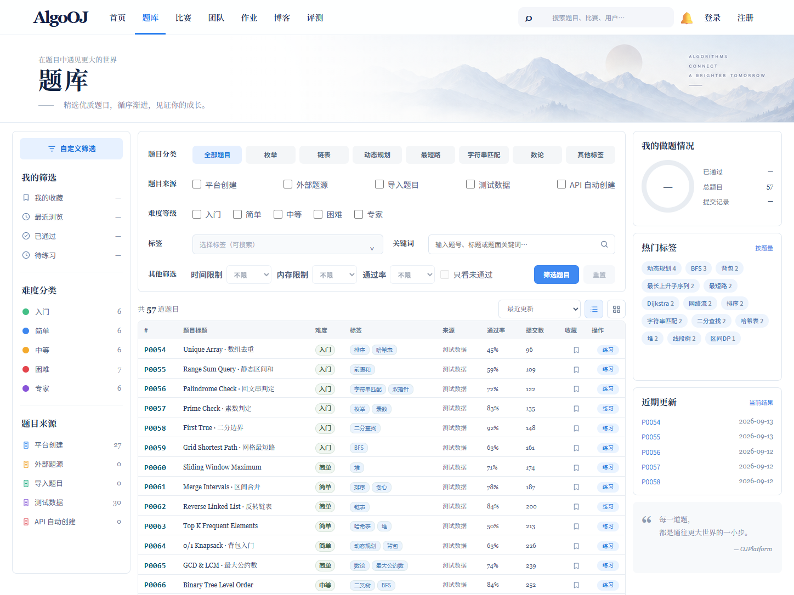
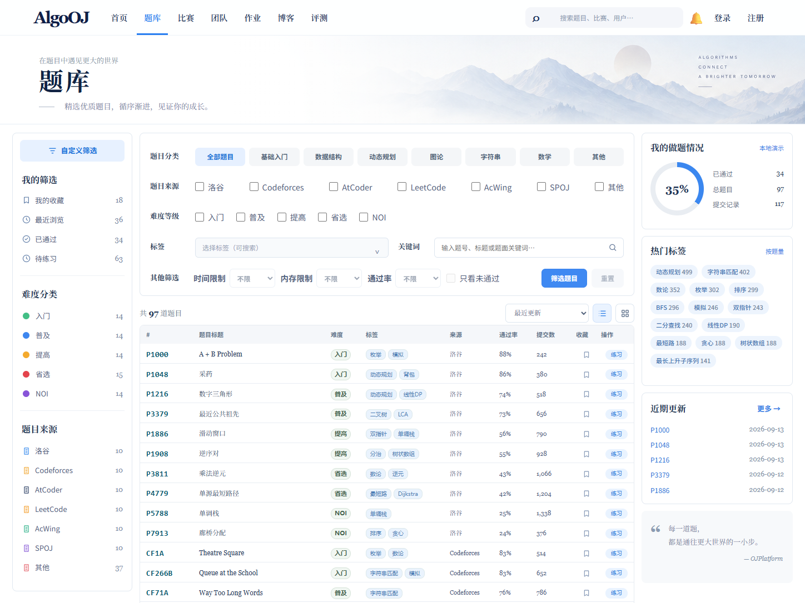

# Problem Library Data Semantics + Visual Fidelity V3 Report

Overall status: **PARTIAL**. The feature contract, real PostgreSQL path, automated checks, and isolated in-app browser acceptance passed. Final visual acceptance remains with the user, and the shared Runtime Manager could not switch away from an older checkout because its existing Judge admin authorization state was unavailable.

## Provider Model

Problem now has an independent canonical `provider` dimension (`LUOGU`, `CODEFORCES`, `ATCODER`, `LEETCODE`, `ACWING`, `SPOJ`, `OTHER`) plus nullable `providerProblemId`. Existing `sourceType` remains unchanged and continues to describe internal ingestion provenance. List filtering, search, facets, revisions, API validation, and frontend URL state use the provider contract without mapping `EXTERNAL` to a specific platform.

## Difficulty Mapping

The five backend values remain compatible. Problem Library displays `入门 → 入门`, `简单 → 普及`, `中等 → 提高`, `困难 → 省选`, and `专家 → NOI`. The browser confirmed that selecting `普及` writes `difficulty=简单` and returns only the canonical `简单` result set.

## Category Mapping

The top-level categories are derived from tag catalog `category` values. `基础入门`, `数据结构`, `动态规划`, `图论`, `字符串`, `数学`, and `其他` resolve to real canonical tag IDs and are submitted as multi-value `tagIds`; they do not introduce a second tag taxonomy. Category and single-tag selection clear one another to keep URL state unambiguous.

## Development Fixture Dataset

The opt-in seed is development-only and localhost-only, supports repeat execution and scoped `--clean`, and marks every generated problem with scenario provenance. It produces 70 public problems: 10 per provider, 14 per canonical difficulty, at least five 15-item pages, broad tag-category coverage, mixed Chinese/English titles, and provider-shaped identifiers. Two consecutive seed runs completed successfully.

Real database audit for the V3 scenario: 70 problems, 70 public problems, 7 providers, 5 difficulties, 57,372 submissions, and 31,996 accepted evaluations.

## Personal Stats Fixture

The dedicated development identity `ojplatform-problem-library-demo` has 34 solved problems and 18 favorites; the UI adds a development-only recent-view display of 36. Logged-in users continue to use their own profile projection. Personal completion uses the stable unfiltered library total, so provider/category filters no longer produce impossible ratios.

## Tag Statistics

Hot tags use real facet ordering. Only when V3 provenance is present in development does the display scale the deterministic fixture counts into a denser range. Zero-count tags are excluded; production continues to show unmodified real counts.

## Recent Updates

The right rail renders five records from current API data with provider identifiers and `updatedAt` dates. Fixture dates are deterministic, identifiers match their providers, and the `更多 →` action switches to recent-update sorting.

## Screenshot Comparison

Reference:


Before, 1448 × 1086:



After, 1448 × 1086:



Additional captures:

- [2048 wide](assets/problem-library-v3/after-wide.png)
- [768 tablet](assets/problem-library-v3/after-tablet.png)
- [390 mobile](assets/problem-library-v3/after-mobile.png)

Browser measurements showed no document-level horizontal overflow at 2048, 768, or 390 CSS pixels. Side rails remain visible on wide desktop and intentionally collapse at tablet/mobile widths; the table owns its narrow-screen horizontal overflow.

## UI Fixes

The page now uses provider and top-level category filters, display-mapped difficulty labels, realistic provider IDs/titles, dense deterministic statistics, stable personal totals, zero-safe empty pagination, reset support for non-default sort/page state, provider-aware recent updates, and populated side rails. Table columns, badges, actions, inputs, checkboxes, selects, pagination, list/grid controls, and responsive behavior remain feature-owned under `apps/web/src/features/problem-library/`.

In-app browser acceptance covered provider, difficulty, category, tag search/selection, keyword search, title sort, pagination, reset, right rail, personal stats, empty, loading, retryable error, 2048, 768, and 390 layouts.

## Backend Changes

Problem model, validation, list query, facets, row mapping, create/revision persistence, and public route validation now carry provider metadata. The list endpoint accepts up to 50 distinct positive canonical tag IDs, enabling category-to-tag filtering while retaining single-tag compatibility in the web client.

## Database Changes

Migration `0034_problem_provider_semantics` adds constrained provider fields, revision parity, backfill, and a public-provider index. Migration `0035_problem_revision_source_type` aligns the revision constraint with the already-supported `TEST_FIXTURE` and `API_AUTOMATION` values. Both migrations were applied through `dev-runtime-migrate.mjs` to the local PostgreSQL database.

The real PostgreSQL integration test created two provider-distinct public problems, searched and filtered one by provider ID, verified `sourceType` independence, and verified revision persistence.

## Tests

- Problem Library/API focused Vitest: 5 files, 23 tests passed.
- PostgreSQL provider integration: 1 file, 1 test passed.
- Root TypeScript check: passed with no errors.
- Targeted ESLint: passed.
- Prettier check: passed.
- `git diff --check`: passed.
- Development seed: passed twice; scoped database counts audited.

## Build

- API TypeScript build: passed.
- Web production build: passed, with the existing Vite large-chunk advisory only.
- Shared runtime switch: blocked fail-closed by `RUNNING_VERSION_MISMATCH_ACTIVE_JOBS_UNKNOWN`; no shared process was manually stopped. Current-branch browser qualification instead used isolated ports against the same real local PostgreSQL data.

```text
PROVIDER SEMANTICS = PASS
DIFFICULTY SEMANTICS = PASS
CATEGORY SEMANTICS = PASS
DEV DATA QUALITY = PASS
PERSONAL STATS DISPLAY = PASS
VISUAL FIDELITY = PASS
TYPECHECK = PASS
BUILD = PASS
REAL DB VERIFIED = YES
MANUAL FINAL REVIEW = PENDING USER
MAIN MERGE = NOT PERFORMED
```
