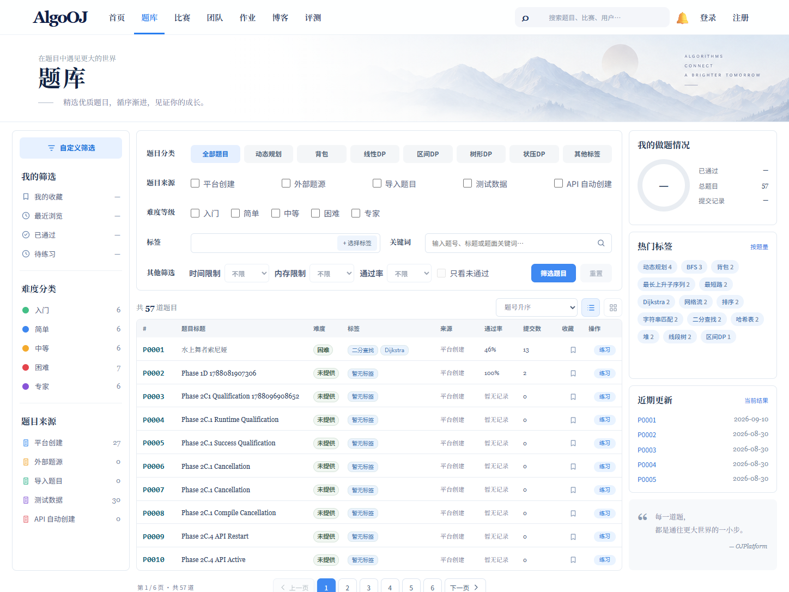
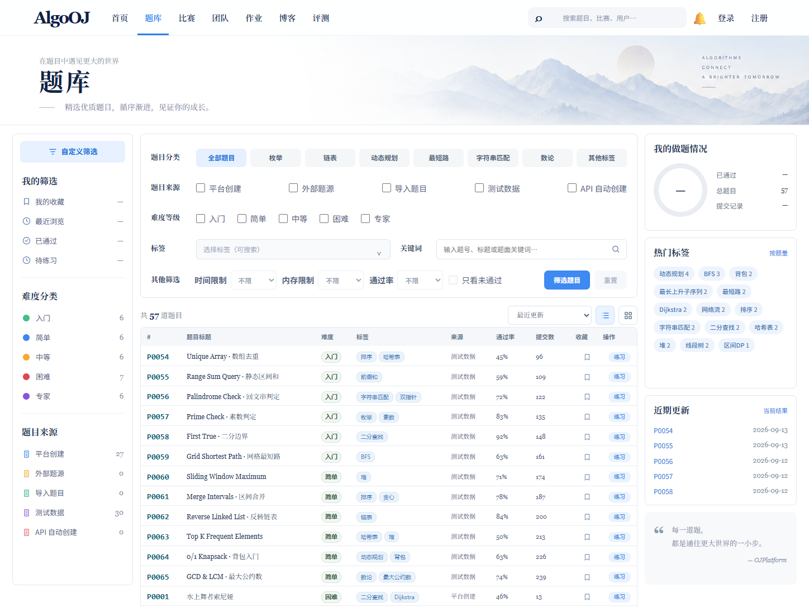
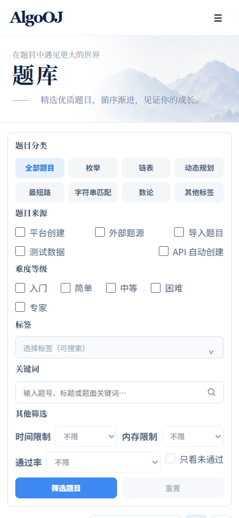

# Problem Library Screenshot Repair Pass V2 Report

Date: 2026-09-13

## Browser Method

- Real-page review used Codex in-app browser against managed local Web/API at `http://127.0.0.1:5173/problems`.
- DOM and computed layout were inspected through browser tooling.
- Persistent evidence was captured with installed Chrome through Playwright CLI.
- No desktop computer-control automation was used.

## Reference Screenshot

- Source: `Goals/题库界面.png`
- Size: `1448 × 1086`

## Before Screenshot

- Baseline commit: `294f63b`
- Viewport: `1448 × 1086`

## After Screenshot

- Viewport: `1448 × 1086`

Mobile evidence:

## Viewport / Zoom

- Desktop CSS viewport: `1448 × 1086`
- Device Pixel Ratio: `1.25`
- Browser zoom/body zoom: `100%` / `1`
- `visualViewport.scale`: `1`
- Mobile CSS viewport: `390 × 844`
- Tablet CSS viewport: `768 × 900`
- Desktop, tablet, and mobile document horizontal overflow: none.
- Wide table overflow remains contained inside its own scroll surface on narrow screens.

## Issues Fixed

- Navbar: retained shared `AppNavbar`, AlgoOJ brand, real routes, search, notification, and auth controls; no page-specific global mutation.
- Hero: increased title scale and adjusted vertical placement while preserving supplied mountain asset and right-side decoration.
- Three-column ratio: retained `216px / flexible / 272px` reference ratio and aligned gaps to `13px`.
- Left sidebar: real facet counts now fill difficulty/source groups after local fixture seed; control alignment and existing icons preserved.
- Filter panel: restored reference-height `294px` density and grouped controls without changing API semantics.
- Tag selector: added reference-like placeholder/chevron treatment; verified open, search, select, dismiss, and canonical numeric `tagIds`.
- Buttons / controls: list and grid toggles now both work with clear pressed states; disabled unsupported filters remain explicit.
- Table layout: page density increased from 10 to 15 rows, row height reduced to `30px`, mixed Chinese/English fixture titles added, deterministic rates/submission counts shown, and real source/difficulty/tag contracts retained.
- Right rail: hot tags and recent updates now use populated fixture facets/current results; unauthenticated personal statistics remain honest placeholders.
- Dev fixture data: development-only, localhost-guarded, opt-in, deterministic, provenance-marked, repeatable data added.
- Responsive: mobile stacks filters, hides desktop rails, keeps controls usable, and contains table overflow; tablet layout has no page overflow.

## Interaction States Checked

- Category tab selection
- Source checkbox filtering
- Difficulty checkbox filtering
- Tag selector open/search/select and URL-backed numeric `tagIds`
- Keyword submit and reset
- Sort selection
- Pagination to page 2
- List/grid switching
- Disabled time/memory/pass-rate and personal-state controls
- Loading skeleton and populated state
- Desktop, tablet, and mobile responsive states

## Assets Added

- `Docs/reports/assets/problem-library-v2/before-desktop.png`
- `Docs/reports/assets/problem-library-v2/after-desktop.png`
- `Docs/reports/assets/problem-library-v2/after-mobile.png`
- No new UI dependency or remote asset added.

## Development Data Added

- 30 local `TEST_FIXTURE` problems.
- 8,535 deterministic demo submissions and 8,535 completed demo evaluations.
- Problem provenance: `PROBLEM_LIBRARY_FULL_EXPERIENCE_V2`.
- Fixture execution requires `OJPLATFORM_DEVELOPMENT_FIXTURES=true` and a loopback `DATABASE_URL`.
- Second run preserved exact counts: 30 problems / 8,535 submissions / 8,535 evaluations.
- Production startup and production data remain untouched.

## CSS Changes

- All Problem Library visual rules remain in `apps/web/src/features/problem-library/ProblemLibraryPage.css`.
- No Problem Library rule was added to `apps/web/src/app/app.css`.
- Shared `TagSelector` received only an accessibility label; visual overrides remain feature-owned.

## Tests

- Focused Problem Library tests: `2/2 PASS`.
- TypeScript typecheck: PASS.
- `git diff --check`: PASS.

## Build

- Web production build: PASS.
- Existing Vite large-chunk advisory remains non-blocking.

SCREENSHOT COMPARISON = PASS

PROBLEM LIBRARY UI QUALITY = PASS

FILTER PANEL = PASS

TAG SELECTOR = PASS

TABLE QUALITY = PASS

RIGHT RAIL = PASS

DEV DATA = PASS

TYPECHECK = PASS

BUILD = PASS

MANUAL FINAL REVIEW = PENDING USER

MAIN MERGE = NOT PERFORMED
